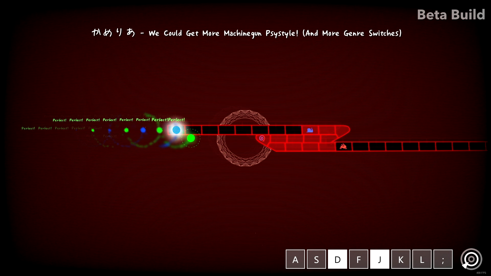

# KeyViewer

An easily configurable and always-on-top overlay showing when keys are pressed. Very useful for rhythm games!

## Installation

1. Download the latest `KeyViewer-x.x.x.zip` version from the [Releases](https://github.com/PizzaLovers007/KeyViewer/releases) page
1. Unzip to any location
1. Run `KeyViewer.exe`

## Features

* Add/Remove any key
* Change both the active and inactive fill, outline, and text color for each individual key
* Click-and-drag to reorder the keys